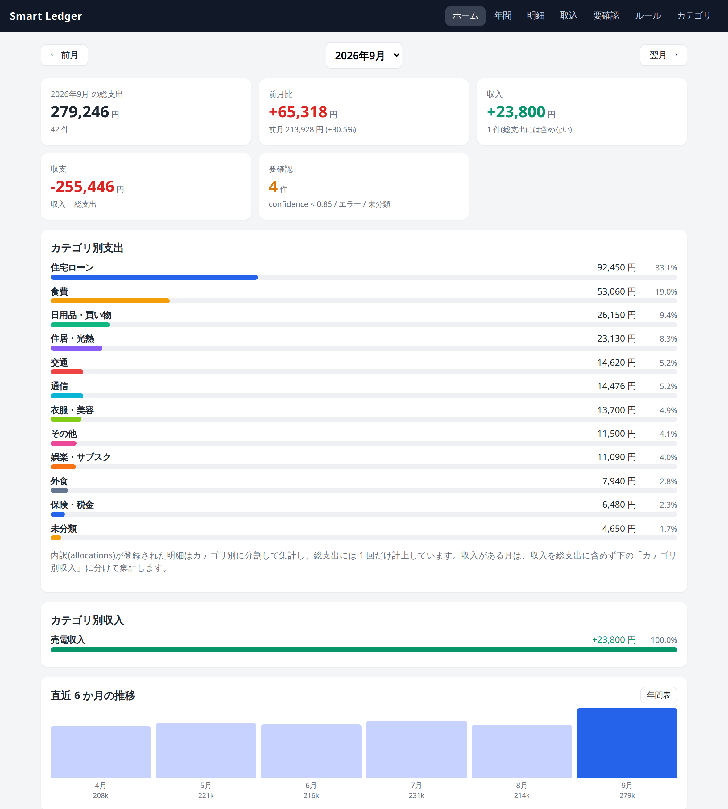

# Smart Ledger

クレジットカード会社の Web サイトからダウンロードした **利用明細 CSV**、および銀行口座の **入出金明細 CSV**(住宅ローンの返済と売電の入金)を取り込み、
明細を正規化・重複除外し、加盟店ルールと TypeSafe AI の **Jev** でカテゴリ(初期値 12 種、画面から追加可)に分類、
**Excel(`data/household.xlsx`)を正本として永続化** し、ブラウザから家計簿として閲覧・修正できる
個人用 Web アプリです。

- Windows 上で直接動作(WSL / Docker / SQL / クラウド DB 不要)
- Python 3.12+ / Flask / openpyxl / httpx（環境構築・依存管理は uv）
- スマートフォン幅でも見やすいレスポンシブ UI
- Dropbox デスクトップアプリの同期フォルダへ自動コピー(閲覧・バックアップ用)



ダッシュボードの上部です(デモ用の架空データ)。この続きと、ほかの画面のキャプチャは [docs/SCREENSHOTS.md](docs/SCREENSHOTS.md) にまとめています。

## 主な機能

| 画面 | 内容 |
| --- | --- |
| ダッシュボード | 対象年月の総支出・前月比・カテゴリ別支出と割合・直近 6 か月推移・最近の明細。収入がある月は収入・収支(収入 − 総支出)とカテゴリ別収入も表示。月切替は `← 前月 / 翌月 →` |
| 年間表 | 対象年の 12 か月 × カテゴリのマトリクス(右端に年間合計、最下行に月間総支出・月間収入・収支)と年間総支出・月平均。年切替は `← 前年 / 翌年 →`、カテゴリの金額を押すと該当月・カテゴリの明細一覧へ、月間総支出を押すとその月のダッシュボードへ。CSV / Excel でエクスポート。内訳で分割したカテゴリのリンク先の一覧は明細金額で合計するため、セルの金額と一致しない場合があります |
| 明細一覧 | 利用日・加盟店・金額・カテゴリ・分類元(rule / jev / manual / error)・confidence。月・収支(支出 / 収入)・カテゴリ・分類元・加盟店名で絞り込み。内訳のある明細は下に内訳行(カテゴリ・金額・メモ)を表示(スマホはタップで開閉。ダッシュボードの最近の明細も同じ) |
| CSV 取込 | CSV 選択 → 解析(カード明細 / 銀行明細を自動判定) → プレビュー(新規件数 / 重複件数 / 対象外件数) → 「取り込む」で新規明細だけ分類して Excel 保存 |
| 要確認 | confidence < 0.85、Jev エラー、未分類の明細。その場でカテゴリ確定 |
| 明細編集 | カテゴリ変更(今回だけ / 今後この加盟店も)、収支(支出 / 収入)の変更、メモ、**内訳分割(allocations)** |
| ルール | 加盟店ルール(merchant_rules)の一覧・追加・削除 |
| カテゴリ | カテゴリの追加・名称変更・並び替え・削除。名称変更は明細・ルール・内訳に伝播。Jev 向けの説明文も編集できる |

### 分類の流れ

```
新規明細 → 加盟店名正規化(NFKC・空白整理)
        → merchant_rules を検索 ── 一致 → category(source=rule)
        → 不一致 → Jev(choice)で登録カテゴリから 1 つ選択 → category + confidence(source=jev)
              confidence >= 0.85 → 自動採用
              confidence <  0.85 → 「要確認」
        → Jev エラー / API キー未設定 → category=その他, source=error, 「要確認」(取込は継続)
```

Jev は「未知の加盟店に初期カテゴリを付ける交換可能な分類器」として
[`smart_ledger/services/classifier.py`](smart_ledger/services/classifier.py) の `Classifier` Protocol の実装の 1 つになっています。
アプリの中心は Transaction / Category / MerchantRule / Allocation です。

## Windows でのセットアップ

### 前提

- Windows 10 / 11
- PowerShell(Windows 標準の Windows PowerShell 5.1 または PowerShell 7)
- [uv 0.12.17 以上](https://docs.astral.sh/uv/getting-started/installation/)(Python 3.12 は uv が自動で用意します)

uv が未導入でも、`setup.cmd` の実行中に winget でインストールできます。確認が表示されたら `Y` または Enter キーを押してください。

### 1. リポジトリを取得

```powershell
git clone <このリポジトリのURL> smart-ledger
cd smart-ledger
```

### 2. setup.cmd を実行

エクスプローラーで **`setup.cmd` をダブルクリック** します。PowerShell から実行する場合も入口は同じです。

```powershell
.\setup.cmd
```

`setup.cmd` は内部の PowerShell スクリプトを呼び出し、次を行います。利用者が `.ps1` を直接選ぶ必要はありません。

1. uv を検出
2. Python 3.12 と仮想環境 `.venv` を用意
3. `uv.lock` に従って依存パッケージを同期
4. `data/`、`data/backup/`、`data/staging/`、`logs/` を作成
5. `.env` が無ければ `.env.example` からコピー

#### うまく動かないとき

- **ウィンドウがすぐ閉じる**: PowerShell を開いて `.\setup.cmd` または `.\start.cmd` を実行すると、閉じる前のメッセージを確認できます。セットアップの詳細は `logs\setup_YYYYMMDD_HHMMSS.log` にも記録されます
- **起動したのに画面が古い / 変更が反映されない**: 起動中のウィンドウを閉じずに再度 `start.cmd` を実行すると、Windows では同じポートに 2 つ目のサーバーが同居し、古い方が応答し続けることがあります。現在は 2 つ目の起動を検知して既存の画面をブラウザで開くだけにしています。コードを更新したら、起動中のウィンドウで Ctrl+C してから `start.cmd` を実行してください
- **「ポート 5000 は使用中ですが Smart Ledger の応答を確認できませんでした」と出る**: 別のプログラムが同じポートを使っているか、応答しなくなった Smart Ledger のウィンドウが残っています。該当ウィンドウを閉じるか、`.env` の `SMART_LEDGER_PORT` を別の番号に変えてください。「ポート 5000 を使用できません(予約済み、または権限がありません)」の場合は OS がそのポートを予約しているので、ポート番号を変えてください
- **「Smart Ledger を起動します」の後、何分も反応がない**: `\\wsl.localhost\...` など WSL やネットワーク上のフォルダから起動すると、`.venv` のライブラリ読み込みがファイル共有越しになり、起動に 1〜3 分かかります。Windows のローカルディスクに `git clone` して `setup.cmd` → `start.cmd` を実行してください
- **「デジタル署名されていません」「スクリプトの実行が無効」**: ZIP でダウンロードしたファイルはブロック属性が付きます。フォルダ内で `Get-ChildItem -Recurse | Unblock-File` を実行してから `setup.cmd` を再実行してください。`git clone` したファイルには付きません
- **uv が見つかりません**: `setup.cmd` の確認で `Y` または Enter キーを押すと winget で自動インストールされます。`winget` 自体が見つからない場合は、Microsoft Store の App Installer を更新してください
- **uv sync に失敗**: `uv --version` でバージョンを確認し、0.12.17 未満なら `winget upgrade --id=astral-sh.uv -e` で更新してください。解消しない場合はネットワーク・プロキシ設定を確認してください。会社ネットワークでは PowerShell の `HTTPS_PROXY` 環境変数など、組織指定のプロキシ設定が必要な場合があります

### 3. .env を設定

`.env` をテキストエディタで開き、必要な値を設定します(`.env` は Git 管理外です)。

```ini
# TypeSafe AI (Jev) の API キー(必須: 自動分類に使用)
TYPESAFE_API_KEY=ts-xxxxxxxxxxxxxxxx

# Jev モデル名(通常は変更不要)
TYPESAFE_MODEL=jev-latest

# 自動採用する confidence の閾値
CLASSIFICATION_CONFIDENCE_THRESHOLD=0.85

# Dropbox 同期フォルダ(任意。未設定ならバックアップをスキップ)
DROPBOX_SMART_LEDGER_PATH=C:\Users\xxxxx\Dropbox\SmartLedger

# ポート(任意。省略時 5000)
SMART_LEDGER_PORT=5000
```

#### TypeSafe API Key の取得

1. <https://typesafe.ai> でアカウントを作成し、<https://console.typesafe.ai> で API キーを発行
2. `.env` の `TYPESAFE_API_KEY=` に貼り付け
3. アプリを再起動

API キーが未設定でもアプリは動作します。その場合、ルールに一致しない加盟店は
「その他 / source=error / 要確認」として取り込まれるので、要確認画面から手動で分類できます。

Jev に送信するのは **加盟店名(正規化後)・金額・利用日のみ** です。
指示文では、カード会社の半角カナ略称の読み替え(デンワリヨウリヨウ=電話利用料 など)と「○ガツブン」が月次請求であることを説明し、
カテゴリ説明にもカナ例を含めています(`smart_ledger/constants.py` の `CATEGORY_DESCRIPTIONS`。カテゴリ画面の「説明」で上書きできます)。
氏名・会員番号・カード番号は送信しません(そもそも CSV から読み取りません)。

### 4. start.cmd で起動

`start.cmd` をダブルクリック、または PowerShell で次を実行します。

```powershell
.\start.cmd
```

- セットアップ済み `.venv` の Python で Flask を直接起動し、既定のブラウザで <http://localhost:5000> を自動的に開きます（通常起動では `uv run` の同期確認を挟みません）
- 終了は PowerShell で `Ctrl+C`

手動で起動する場合:

```powershell
.\.venv\Scripts\python.exe app.py --open-browser
```

## CSV 取込方法

1. カード会社の会員サイトから利用明細 CSV(例: `ご利用明細_202610.csv`)、または銀行の口座明細 CSV をダウンロード
2. ブラウザで **取込** を開き、CSV を選択して「解析してプレビュー」
3. プレビューで利用日・加盟店・金額と **新規 / 重複** 件数を確認
4. 「N 件を取り込む」を押すと、新規明細だけを分類して Excel に保存
   (Jev への問い合わせのため、加盟店数に応じて数秒〜数十秒かかります)
5. 要確認がある場合は要確認画面へ移動するので、カテゴリを確定

取り込みをやり直したいときは、取込画面の **取込履歴** で「取り消す」を押します。その取込の明細と内訳、履歴が削除され、
同じ CSV を取り込み直せるようになります(手動で変更したカテゴリ・メモも消えます。加盟店ルールとカテゴリは残ります)。
後の取込で「重複」としてスキップされた明細は最初の取込に属したままなので、最初の取込を取り消すとそれらも消えます
(その場合は後の CSV を取り込み直すと、消えた分だけ取り込めます)。

### 対応 CSV 形式

ヘッダー行の目印で 2 つのプロファイルを自動判定します(`ご利用年月日` があれば card、なければ `日付` で bank)。
文字コードはどちらも UTF-8(BOM 有無どちらも) → CP932 の順に自動判定し、**月次集計は請求月ではなく各明細の利用日(usage_date)基準** です。

#### card(クレジットカードの利用明細)

- 先頭にメタ情報(会員番号・対象カード・お支払日・今回お支払金額)があり、
  その後に **`ご利用年月日` から始まる明細ヘッダー行** が続く形式
- ヘッダー行は固定行数ではなく `ご利用年月日` で検出します
- ヘッダー直後のカード保有者行(`****-****-****-1234 氏名`)や合計行など、利用日として読めない行は無視
- 取得項目: 利用日(`ご利用年月日`)、加盟店(`ご利用箇所`)、金額(`ご利用額`。空で `払戻額` があれば負の金額)、カード名(メタ情報の `対象カード`)

#### bank(銀行口座の入出金明細)

- 1 行目が **`日付` から始まるヘッダー行**(`日付, 内容, 出金金額(円), 入金金額(円), 残高(円), メモ`)で、新しい日付が先に並ぶ形式
- 取得項目: 利用日(`日付`)、内容(`内容`)、金額(`出金金額` は支出、`入金金額` は収入)。**残高は取り込みません**
- 口座名(`card` 列)は `銀行口座` に固定します(CSV から読まないため、重複判定が口座名の表記揺れで外れません)
- **家計簿に関係する行だけを取り込みます**。`内容` が下表の正規表現に一致しない行(税金・利息・口座間の資金移動・個人宛振込など)は
  「対象外」として読み飛ばし、プレビューに件数だけ表示します

| `内容` の正規表現 | カテゴリ | 収支 |
| --- | --- | --- |
| `約定返済.*住宅` | 住宅ローン | 出金なので支出 |
| `トウデンPG\s*コウニユウ` | 売電収入 | 入金なので収入 |

一致した行はカテゴリが確定しているため、**Jev には問い合わせません**(`classification_source` は `rule`)。
逆に、カード明細を Jev で分類するときは上表のカテゴリを選択肢に含めません(明細編集で手動で付けることはできます)。
同じ内容に加盟店ルールを登録している場合はそちらが優先されるので、カテゴリを付け替えて運用できます。
上表のカテゴリが実際に使われたのに `categories` シートに無い場合(旧ファイル)は、取込時に自動で追加します
(加盟店ルールで別のカテゴリに振っているときは追加しません)。
対象を増やすときは `smart_ledger/constants.py` の `BANK_CSV_TARGETS` に行を足してください。

### 重複取込防止

- CSV ファイル全体の SHA-256 を `imports.file_hash` と照合し、同一ファイルなら
  「このCSVはすでに取り込み済みです」と表示(取り消しで消えた明細がある場合だけ、その新規分を取り込める)
- 取り込めるのは新規の明細がある場合だけ。すべて取込済みの明細と一致すれば確定を拒否
- 明細単位では `row_key = SHA-256(利用日 | 正規化加盟店名 | 金額 | 同ファイル内での同組み合わせの出現回数)` で照合
  - 照合は同じカード名(`card`)の明細どうしで行うため、別カードの同一明細(家族カード等)は重複扱いになりません
  - 同日・同加盟店・同金額の正当な複数決済は「出現回数」で区別されるため、両方とも取り込まれます
  - 別ファイル(例: 確定前と確定後の CSV)で重なる明細だけをスキップできます

## Excel 保存場所とデータ構造

正本は **`data/household.xlsx`** です(`SMART_LEDGER_EXCEL_PATH` で変更可)。

| シート | 列 |
| --- | --- |
| `transactions` | `id`, `usage_date`, `merchant_raw`, `merchant_normalized`, `amount`, `category`, `confidence`, `classification_source`, `card`, `import_id`, `imported_at`, `row_key`, `memo`, `kind` |
| `merchant_rules` | `merchant_pattern`, `category`, `created_at` |
| `categories` | `category`, `sort_order`, `description` |
| `imports` | `import_id`, `filename`, `file_hash`, `imported_at`, `card`, `row_count` |
| `allocations` | `transaction_id`, `category`, `amount`, `memo` |

- `merchant_raw` は CSV の元の表記をそのまま保持し、`merchant_normalized` は NFKC 正規化・前後空白除去・連続空白整理後の値
- `classification_source` は `rule` / `jev` / `manual` / `error`。`confidence` は `jev` のときのみ値が入ります
- `kind` は `expense`(支出) / `income`(収入)。**収入も `amount` は正の数**で持ち、向きは `kind` で表します(総支出が収入で目減りして見えないようにするため)。
  `kind` 列が無い旧ファイルは全行 `expense` として読み込み、次の保存で列が追加されます
- カテゴリは **カテゴリ** 画面から追加・名称変更・並び替え・削除できます(初期値は 12 カテゴリ)。`description` は Jev がカテゴリを選ぶときの説明文で、空なら組み込みの既定説明、それも無ければカテゴリ名を使います
- カテゴリ名は `=` `+` `-` `@` で始められません(CSV / Excel に書き出したとき数式として解釈されるため)。「未分類」はカテゴリが空の明細を指す予約語なので登録できません
- 名称変更は `transactions` / `merchant_rules` / `allocations` の `category` にも反映されます(名称変更時に説明が空なら旧名の既定説明を引き継ぎます)。使用中のカテゴリと「その他」(分類エラー時の受け皿)は削除できません

### カテゴリ(初期値)

食費 / 外食 / 日用品・買い物 / 住居・光熱 / 住宅ローン / 通信 / 交通 / 保険・税金 / 娯楽・サブスク / 衣服・美容 / その他 / 売電収入

`売電収入` は収入用のカテゴリで、月間総支出やカテゴリ別支出には入りません(ダッシュボードの「カテゴリ別収入」と年間表の収入行に出ます)。

### 加盟店ルール

- 明細編集または要確認画面で **「今後この加盟店も同じカテゴリ」** を選んだときだけ `merchant_rules` に追加されます
  (「今回だけ」ではルール化しません。Jev の結果を勝手にルール化することもありません)
- 登録時のパターンは、請求月などの変わる部分(「7ガツブン」「26ネン08ガツ」「8月分」「2026/08」)を除いた **加盟店キー** が提案されます。編集して「オートチャージ」のように共通部分だけ残すこともできます
- 一致は 3 段階です。加盟店名との完全一致 → 加盟店キー同士の完全一致(「6ガツブン ○○」のルールが「7ガツブン ○○」にも効く) → 部分一致(パターンが加盟店名に含まれる、またはパターンのキーが加盟店キーに含まれる。最長パターン優先、大文字小文字は無視)
- 登録時に同じ加盟店キーのルールが既にあれば、そのルールのパターンとカテゴリを置き換えます(旧仕様で登録した「○○ 8ガツブン」のルールは、キー「○○」のルールに更新されます。月ごとに複数あれば 1 つに統合されます)
- ルール登録時、そのルールが(他のルールより優先して)一致する手動修正されていない明細にも同じカテゴリを適用します。取込時の分類と同じ判定です

### 内訳分割(allocations)と集計ルール

KYASH のようなまとめ決済を複数カテゴリに分けられます。

```
KYASH 10,000 円
  食費            3,500
  日用品・買い物   4,000
  外食            2,500
  ------------------------
  合計           10,000  ← transactions.amount と一致しないと保存不可
```

- 内訳が無い明細 → `transactions.category` でカテゴリ集計
- 内訳がある明細 → **月間総支出では `transactions.amount` を 1 回だけ**、**カテゴリ別集計では `allocations` を使用**
- 二重計上は発生しません(pytest で検証)。年間表も同じ規則で、月間総支出の行は明細金額、カテゴリの行は内訳で集計します
- 明細一覧のカテゴリ絞り込みは `transactions.category` に加えて内訳のカテゴリにも一致します。件数・合計は `transactions.amount` で数え、内訳の金額は足し込みません(内訳で分割したカテゴリの年間表セルでは、リンク先の一覧の合計がセルの金額と一致しない場合があります)
- 収入(`kind=income`)は総支出・前月比・6 か月推移のいずれにも含めず、収入とカテゴリ別収入として別に集計します

### 年間表のエクスポート

年間表の「CSV」「Excel」ボタンで、表示中の年のカテゴリ × 月の表(見出し行、カテゴリ行、月間総支出の行。右端が年間合計)をダウンロードできます。
その年に収入があれば、月間総支出の下に収入のカテゴリ行・`月間収入`・`収支` の行が続きます。
CSV は BOM 付き UTF-8(Windows の Excel でそのまま開けます)、Excel は 1 シート(`YYYY年`)で金額は 3 桁区切りです。
ファイル名は `smart_ledger_YYYY.csv` / `smart_ledger_YYYY.xlsx` で、正本の `household.xlsx` には書き込みません。

### 保存の安全性

1. 一時ファイル(`data/~household.<pid>.tmp.xlsx`)へ書き出し
2. openpyxl で再オープンして検証
3. 既存の正本を `data/backup/household_YYYYMMDD_HHMMSS.xlsx` に世代バックアップ(既定 20 世代、`BACKUP_GENERATIONS` で変更)
4. `os.replace` で正本を置換
5. Dropbox 設定時は latest / backup へコピー

- 同一秒内に 2 回保存した場合、2 回目のバックアップ名は `household_YYYYMMDD_HHMMSS_ffffff.xlsx`(マイクロ秒付き)になり、それでも重なる場合は連番を付けるため、先の世代を上書きしません(ローカル・Dropbox 共通)
- 読み込み → 変更 → 保存の一連の処理はアプリ内のロックで直列化されるため、複数の操作が同時に届いても先の変更が後の保存で消えることはありません

Excel が他のアプリで開かれてロックされている場合は、正本を変更せずエラー画面で通知します。

## Dropbox バックアップ設定

Dropbox API は使いません。Windows の Dropbox デスクトップアプリが同期しているローカルフォルダにコピーします。

```ini
DROPBOX_SMART_LEDGER_PATH=C:\Users\xxxxx\Dropbox\SmartLedger
```

保存成功のたびに次へコピーされます。

```
Dropbox/SmartLedger/
├─ latest/
│  └─ household.xlsx                  ← iPhone の Dropbox / Excel アプリから閲覧
└─ backup/
   └─ household_YYYYMMDD_HHMMSS.xlsx
```

- 未設定(空)の場合はスキップします
- Dropbox 側の `backup/` もローカルと同じ世代数(既定 20、`BACKUP_GENERATIONS`)だけ残し、古いものは削除します
- Dropbox 側は閲覧・バックアップ用途です。Dropbox 側での編集は Smart Ledger に反映されません(正本は常に `data/household.xlsx`)

## ディレクトリ構成

```
smart-ledger/
├─ app.py                     # 起動スクリプト(--open-browser でブラウザを開く)
├─ pyproject.toml / uv.lock   # 依存関係の定義と再現可能なロック
├─ .python-version            # uv が使用する Python バージョン
├─ setup.cmd / start.cmd      # Windows で利用者が実行するセットアップ・起動ランチャー
├─ scripts/windows/           # ランチャーから呼び出す内部 PowerShell 実装
├─ .env.example               # 設定テンプレート(.env は Git 管理外)
├─ smart_ledger/
│  ├─ __init__.py             # create_app
│  ├─ config.py               # .env / 環境変数の読み込み
│  ├─ models.py               # Transaction / MerchantRule / Category / ImportRecord / Allocation
│  ├─ routes.py               # Flask ルーティング(画面)
│  ├─ logging_setup.py        # ログ設定(カード番号・APIキーのマスク)
│  ├─ services/
│  │  ├─ csv_parser.py        # ヘッダー検出・文字コード判定・row_key
│  │  ├─ normalize.py         # 加盟店名正規化
│  │  ├─ merchant_rules.py    # ルール検索・登録
│  │  ├─ jev_client.py        # TypeSafe Jev API クライアント(httpx)
│  │  ├─ classifier.py        # 分類パイプライン(rule → Jev → 閾値)
│  │  ├─ importer.py          # プレビュー / 確定
│  │  ├─ aggregation.py       # 月次・年間・カテゴリ集計(usage_date 基準)
│  │  ├─ export.py            # 年間表の CSV / Excel エクスポート
│  │  ├─ allocations.py       # 内訳の検証
│  │  ├─ excel_repository.py  # household.xlsx の読み書き(atomic 保存)
│  │  └─ backup.py            # 世代バックアップ・Dropbox コピー
│  └─ templates/              # Jinja2 テンプレート
├─ static/                    # CSS / JS
├─ docs/                      # SCREENSHOTS.md, ROADMAP.md, images/
├─ data/                      # household.xlsx, backup/, staging/(Git 管理外)
├─ logs/                      # smart_ledger.log(Git 管理外)
└─ tests/                     # pytest(fixtures/ に架空データの CSV)
```

## テスト方法

```powershell
uv run --locked pytest -q
```

通常のテストは Jev API を実際には呼ばず、`httpx.MockTransport` でモックしています。主なテスト項目:

- CSV ヘッダー行検出、CP932 / UTF-8 BOM 読込、払戻額の扱い
- merchant_normalized(NFKC・空白整理)
- ファイルハッシュ / row_key による重複検出(同日同加盟店同金額の複数決済を保持)
- 月次集計が利用日基準であること、年間表(カテゴリ × 月・年間合計・月間総支出)と CSV / Excel エクスポート
- merchant rule の適用(完全一致・部分一致・Jev より優先)
- Jev レスポンス解析、confidence 閾値、API エラー時のフォールバック
- allocations の二重計上防止・合計チェック、一覧での内訳行の表示と内訳のカテゴリでの絞り込み(合計は明細金額)
- Excel の read / write、世代バックアップ、旧形式ファイルの互換
- Dropbox パス未設定時のスキップ・設定時のコピー
- Web 画面の一連のフロー(取込 → ダッシュボード → 編集 → ルール → 内訳)
- Jev が不明なカテゴリを返したときの要確認化、429 の再試行、確定再試行時のキャッシュ再利用
- Excel ロック時に正本が変わらないこと、`=` 始まりの文字列が数式にならないこと、不完全行の読み飛ばし
- 別カードの同一明細を重複扱いしないこと、外部 URL への戻り先と別サイトからの POST の拒否
- カテゴリ管理(追加・名称変更の明細 / ルール / 内訳への伝播・並び替え・使用中と「その他」の削除ガード)
- ログのカード番号 / Bearer マスク、Excel セルの日付表現(`2026/8/1` 等)、空行挿入ツール

### 実 API を使うライブテスト

`tests/test_jev_live.py` は TypeSafe Jev の実 API を呼びます(3 回、架空の加盟店名・金額・利用日のみ送信)。
通常の `pytest` ではネットワークや API コストに左右されないよう自動で除外され、`-m live` を指定したときだけ実行されます。
`.env` または環境変数に `TYPESAFE_API_KEY` が無ければ、明示実行時も自動でスキップされます。

```powershell
# ライブテストだけ実行
uv run --locked pytest -m live -rs

# ライブテストを除外して実行(既定値と同じ)
uv run --locked pytest -m "not live"
```

## 開発ルール（CLAUDE.md）

コードスタイルは [CLAUDE.md](CLAUDE.md) に従います。変更後は次を実行してください。

```powershell
# 未使用 import などの確認と整形（シングルクォート、行長 120）
uv run --locked ruff check .
uv run --locked ruff format .

# ブロック終了後（インデントが戻る箇所）の空行を機械的に挿入
uv run --locked python tools\insert_block_blank_lines.py smart_ledger tests tools app.py
```

依存パッケージを変更するときは、実行時依存なら `uv add <package>`、開発用なら `uv add --dev <package>` を使い、`pyproject.toml` と `uv.lock` を一緒に更新します。

- モジュール横断の定数は `smart_ledger/constants.py` に集約し、1 モジュール内で完結する値は関数の既定引数にしています
- ログメッセージは英語小文字の `label: key=value` 形式です（UI 表示や例外メッセージは日本語）

## ログ

`logs/smart_ledger.log`(ローテーション 2MB × 5)。API キー・カード番号・会員番号は出力しません
(CSV のメタ行から読むのは対象カード名のみで会員番号は読み取らず、万一の数字列もフィルタでマスクします)。

## セキュリティ / Git

次のものは `.gitignore` で除外されており、コミットされません。

- `.env`(API キー)
- `.venv/`
- `data/`(household.xlsx、バックアップ、staging)
- `logs/`
- `*.xlsx`、`*.csv`(実際のカード明細)

例外として `tests/fixtures/` 配下の **架空データ** の CSV だけ Git 管理しています。

別サイトのページからの POST(CSRF)は、`Origin` / `Referer` のホストがアプリ自身と一致しない場合に 403 で拒否します。

## 今後の予定

次に実装する機能の候補と優先度は [docs/ROADMAP.md](docs/ROADMAP.md) にまとめています。

## MVP でやらないこと

SQL / SQLite、Docker、WSL 前提、n8n、ユーザー認証、外部公開、Dropbox API、Dropbox → Smart Ledger の逆同期、
iOS ネイティブアプリ、銀行・カード API 連携、スクレイピング、複雑な予算管理、機械学習モデルの自前学習。

## ライセンス

[LICENSE](LICENSE) を参照してください。
