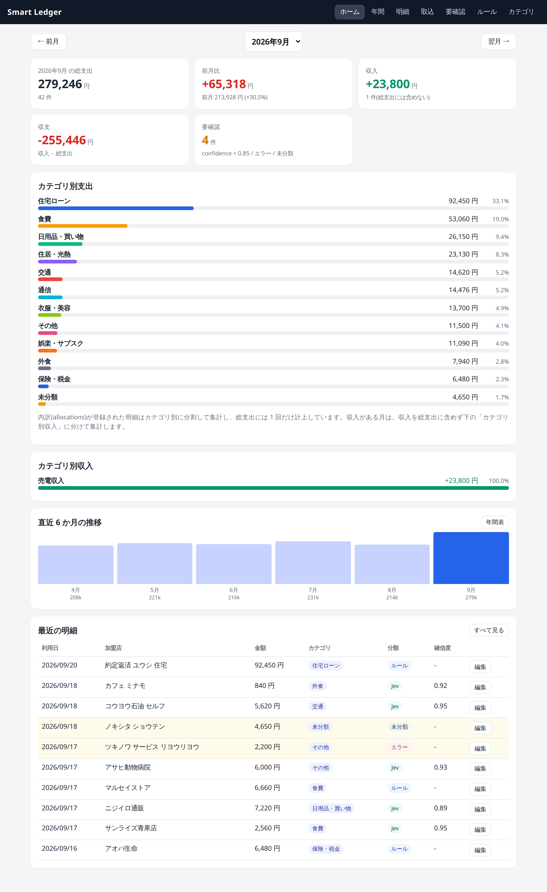
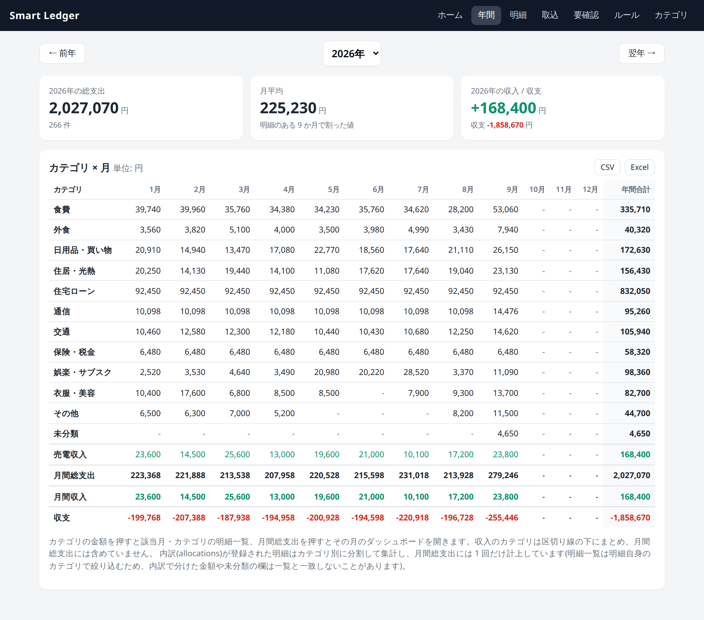
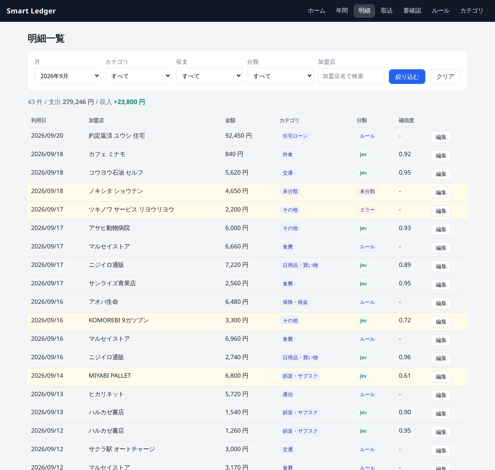
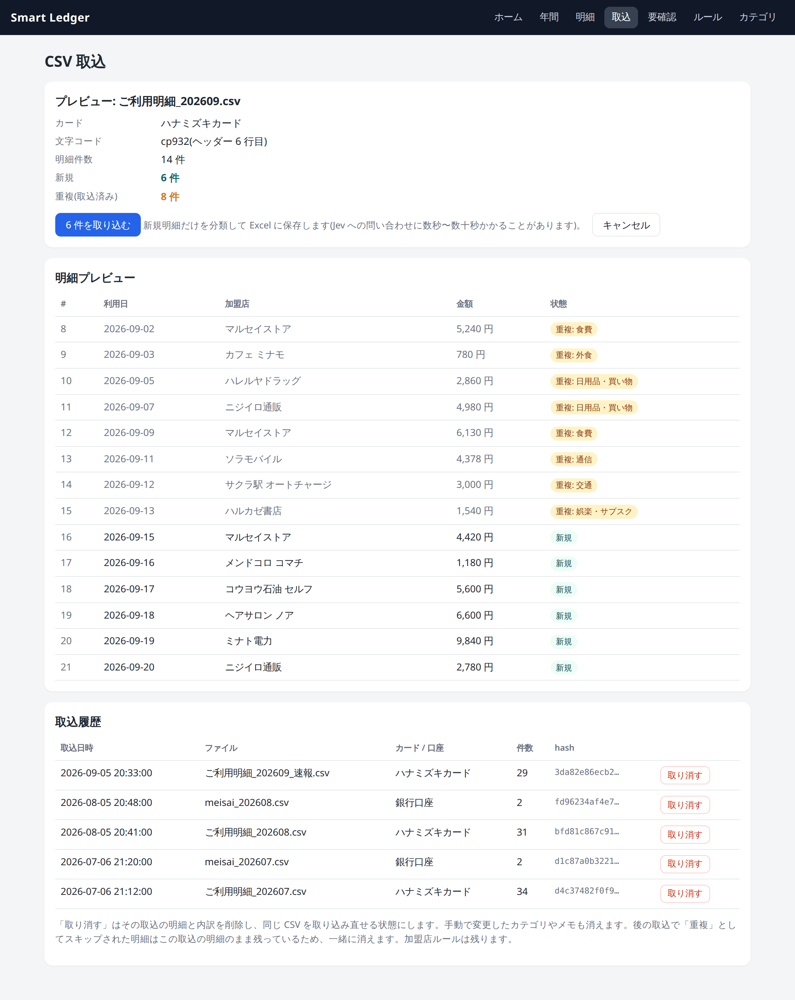
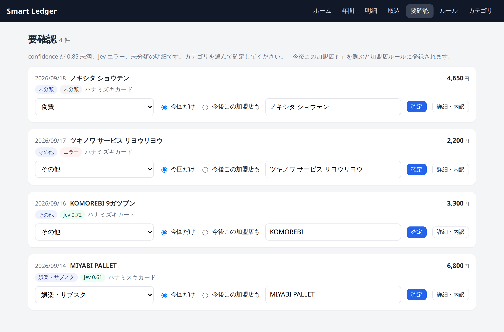
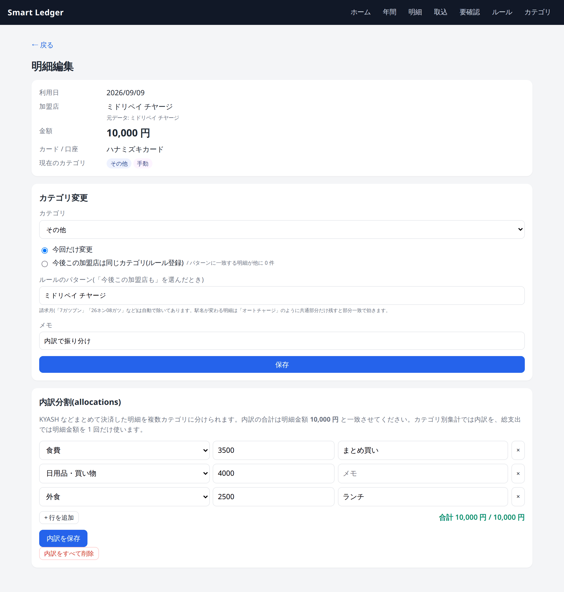
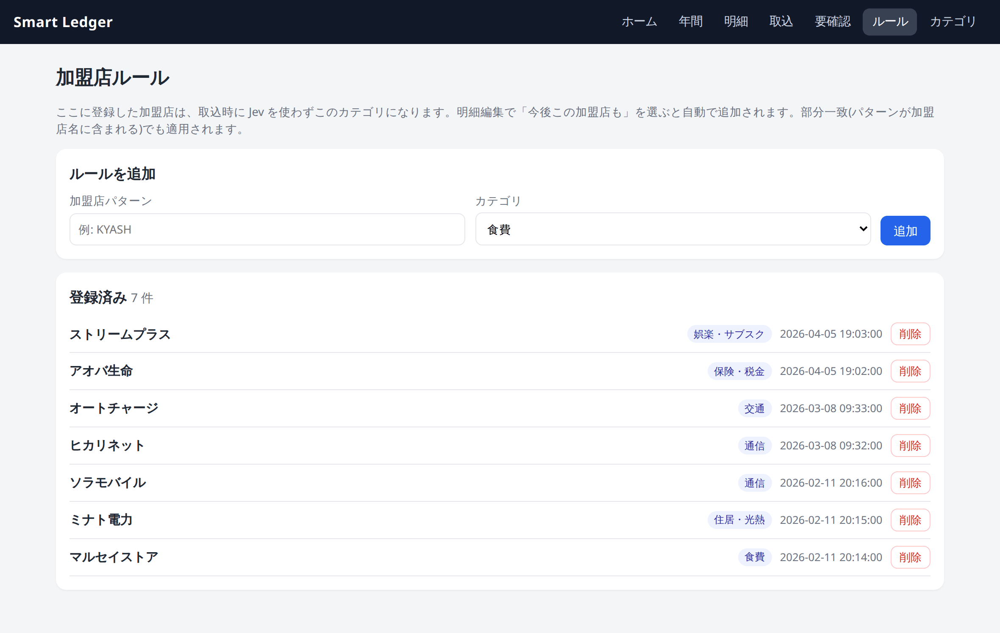
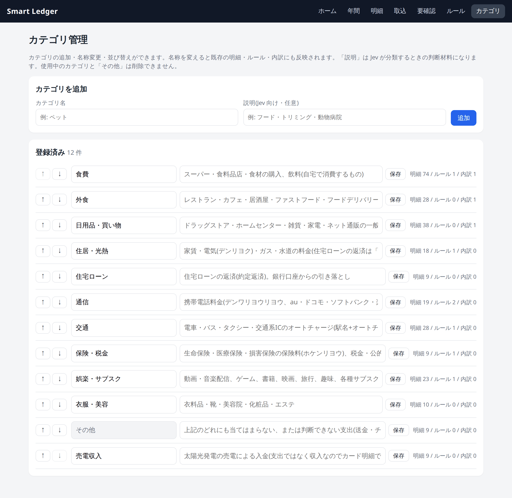
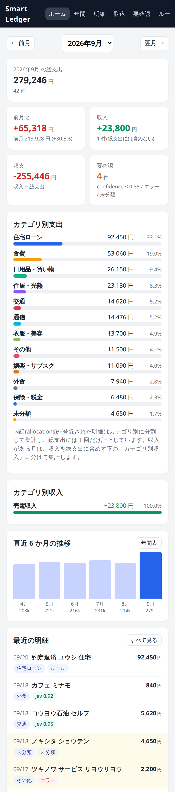

# 画面キャプチャ

Smart Ledger の各画面です。キャプチャはすべて **デモ用の架空データ**(架空の加盟店名・金額)で撮ったもので、実際の利用明細ではありません。
機能の詳細は [README](../README.md) を参照してください。

## ダッシュボード

対象月の総支出・前月比・収入・収支・要確認件数と、カテゴリ別支出、直近 6 か月の推移、最近の明細。月切替は `← 前月 / 翌月 →`。
収入(売電)は総支出に含めず、「カテゴリ別収入」として分けて集計します。

## 年間表

対象年の 12 か月 × カテゴリのマトリクス。右端が年間合計、最下部が月間総支出・月間収入・収支。
カテゴリの金額を押すと該当月・カテゴリの明細一覧へ、月間総支出を押すとその月のダッシュボードへ移動します。CSV / Excel でエクスポートできます。

## 明細一覧

月・収支・カテゴリ・分類元・加盟店名で絞り込み。confidence が低い明細・Jev エラー・未分類の行には色が付きます。

## CSV 取込(プレビュー)

解析した CSV の **新規 / 重複(取込済み)** を確認してから「取り込む」を押します。銀行 CSV の場合は「対象外」件数も出ます。
下は取込履歴で、取込単位で取り消せます。

## 要確認

confidence < 0.85、Jev エラー、未分類の明細。その場でカテゴリを確定でき、「今後この加盟店も」を選ぶと加盟店ルールに登録されます。

## 明細編集(内訳分割)

カテゴリ変更(今回だけ / 今後この加盟店も)、メモ、まとめ決済の内訳分割(allocations)。内訳の合計は明細金額と一致しないと保存できません。

## 加盟店ルール

ここに登録した加盟店は取込時に Jev を使わずこのカテゴリになります。

## カテゴリ

カテゴリの追加・名称変更・並び替え・削除。「説明」は Jev がカテゴリを選ぶときの判断材料になります。

## スマートフォン幅

表はカード形式に切り替わります。

